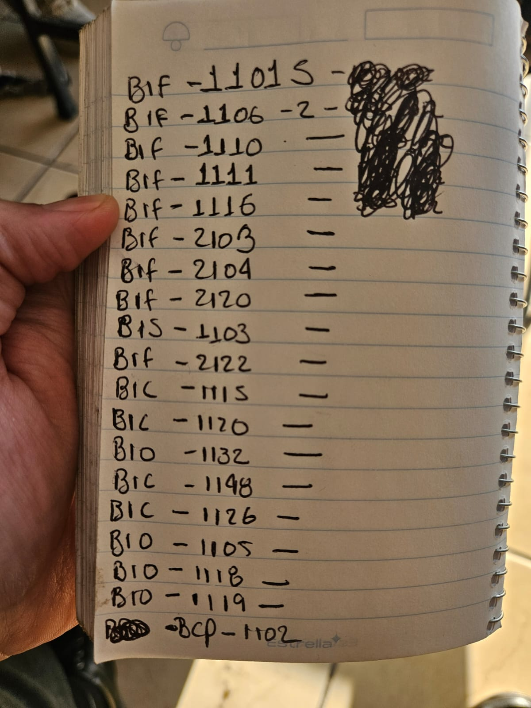

- 
	- microfiltro bosch universal white
	  referencia:: ((69d16fbb-3947-4746-a2b9-fc5a462a20fe))
	  numero_parte:: #BIF-1101
	  dimenciones::  12 * 6 * 3 mm
	  aplicacion:: bosch universal
	  observacion:: blanco
	- microfiltro  denso white
	  referencia:: ((69d17064-de9f-4b5a-abe4-210ac41cdbe7))
	  numero_parte:: #BIF-1102-1
	  dimenciones:: 6 * 3 * 10.7 mm
	  aplicacion:: Denso
	  observacion:: blanco
	- microfiltro  honda rojo
	  referencia:: ((69d1739a-57a4-4e31-a245-52471887a8d4))
	  numero_parte:: #BIF-1106-2
	  dimenciones:: 10.5 * 6 * 13 mm
	  aplicacion:: Honda
	  observacion:: rojo
	- microfiltro  blanco
	  referencia:: ((69d17413-ef82-4046-a1a9-4cf7f57542fb))
	  numero_parte:: #BIF-1101S
	  dimenciones:: 6 * 3 * 10 mm
	  aplicacion:: None
	  observacion:: blanco
	- microfiltro  blanco
	  referencia:: ((69d2a7a0-f6f4-4b0b-8aa2-199c99425243))
	  numero_parte:: #BIF-1110
	  dimenciones:: 6 * 2 * 7 mm
	  aplicacion:: Renault MeganeLogan0280158034
	  observacion:: blanco
	- microfiltro  blanco
	  referencia:: ((69d2a7fe-6686-4b49-85c3-0d399b068e26))
	  numero_parte:: #BIF-1111
	  dimenciones:: 5.5 * 2.5 * 8.4mm
	  aplicacion:: AISAN
	  observacion:: blanco
	- microfiltro  blanco
	  referencia:: ((69d2a85d-c003-4222-aa12-ade587821061))
	  numero_parte:: #BIF-1116
	  dimenciones:: 10.3 * 7 * 11.2 mm
	  aplicacion:: Nissan Tiida
	  observacion:: blanco
	- microfiltro  blanco
	  referencia:: ((69d2a8a6-f432-4757-9aa1-5d1856bb072c))
	  numero_parte:: #BIF-2103
	  dimenciones:: 16 * 7.58 * 12.7mm
	  aplicacion:: GM Delphi Injector17113197,MP-50102
	  observacion:: None
	- microfiltro  blanco
	  referencia:: ((69d2a910-37c2-4a5e-943f-e5a0bd6cca55))
	  numero_parte:: #BIF-2104
	  dimenciones:: 23.5 * 12.5 * 19.7mm
	  aplicacion:: GM Delphi Injector17113197,MP-50102
	  observacion:: None
	- microfiltro  blanco
	  referencia:: ((69d2a95c-85e2-48ed-bcbc-ed579f9393c9))
	  numero_parte:: #BIF-2120
	  dimenciones:: 18 * 14.2 * 15.7mm
	  aplicacion:: Nissan JS50-1 5907
	  observacion:: None
	- microfiltro  blanco
	  referencia:: ((69d2a9c2-0917-4188-97da-863c9de13350))
	  numero_parte:: #BIS-1103
	  dimenciones:: 9.9 * 7.45 * 1.5mm
	  aplicacion:: Denso Injector
	  observacion:: None
	- microfiltro  blanco
	  referencia:: ((69d2aa15-531f-4e98-9ea5-b048dc322b39))
	  numero_parte:: #BIF-2122
	  dimenciones:: 24.5 * 18.6 * 14.4mm
	  aplicacion:: Nissan
	  observacion:: None
	- microfiltro  blanco
	  referencia:: ((69d2aa6a-6d51-4013-88ad-bec2076485ce))
	  numero_parte:: #BIC-1115
	  dimenciones:: 13.2 * 7.1 * 8.5mm
	  aplicacion:: Delphi Injector 25334150
	  observacion:: GB2-138
	- microfiltro  blanco
	  referencia:: ((69d2aad9-81aa-42d0-bcb8-e0256acde232))
	  numero_parte:: #BIC-1120
	  dimenciones:: 12.2 * 8 * 5.2 * 12.5 * 9.6mm
	  aplicacion:: Honda
	  observacion:: None
	- microfiltro  blanco
	  referencia:: ((69d2ab38-8070-4962-8f1b-930da9e7f477))
	  numero_parte:: #BIO-1132
	  dimenciones:: 6.58 * 4.27mm
	  aplicacion:: Ford
	  observacion:: None
	- microfiltro  blanco
	  referencia:: ((69d2abaa-e96d-4c52-bed0-62ed8c4d014f))
	  numero_parte:: #BIC-1148
	  dimenciones:: 9.1 * 7.1 * 5.6mm
	  aplicacion:: Denso
	  observacion:: None
	- microfiltro  blanco
	  referencia:: ((69d2abf2-6985-4cd9-8fdc-d3ac09b03e0c))
	  numero_parte:: #BIC-1126
	  dimenciones:: 9.3 * 4.2 * 5.3mm
	  aplicacion:: Denso
	  observacion:: None
	- microfiltro  blanco
	  referencia:: ((69d2ac54-7912-4108-9f37-9ad6ccbb17ae))
	  numero_parte:: #BIO-1105
	  dimenciones:: 7.8 * 1.9mm
	  aplicacion:: Chrysler,Mitsubish
	  observacion:: GB3-125
	- microfiltro  blanco
	  referencia:: ((69d2ac9f-756a-43d2-abc3-6bb7e4bd0efe))
	  numero_parte:: #BIO-1118
	  dimenciones:: None
	  aplicacion:: Oval O ring GM CPI 8 Cylinder Spider Injectors
	  observacion:: GB3-254
	- microfiltro  blanco
	  referencia:: ((69d2acde-31c2-4f8e-b85e-89b1b70f8f1d))
	  numero_parte:: #BIO-1119
	  dimenciones:: None
	  aplicacion:: Oval O ring GM CPI 6 Cylinder Spider Injectors
	  observacion:: GB3-255
	- microfiltro  blanco
	  referencia:: ((69d2ad16-983e-4c60-ad8d-f34cef334d79))
	  numero_parte:: #BIO-1102
	  dimenciones:: 12.6 * 8.1 * 60.4mm
	  aplicacion:: GM SCPI Spider Injector
	  observacion:: GB5-137
- numero de partes que compra el laboratorio de inyectores
	- {:height 449, :width 337}
		- #BIF-1101S
		- #BIF-1106-2
		- #BIF-1110
		- #BIF-1111
		- #BIF-1116
		- #BIF-2103
		- #BIF-2104
		- #BIF-2120
		- #BIS-1103
		- #BIF-2122
		- #BIC-1115
		- #BIC-1120
		- #BIO-1132
		- #BIC-1148
		- #BIC-1126
		- #BIO-1105
		- #BIO-1118
		- #BIO-1119
		- #BCP-1102